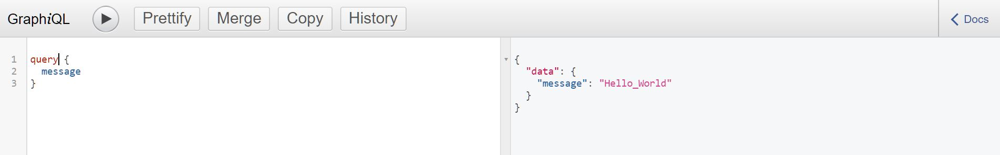
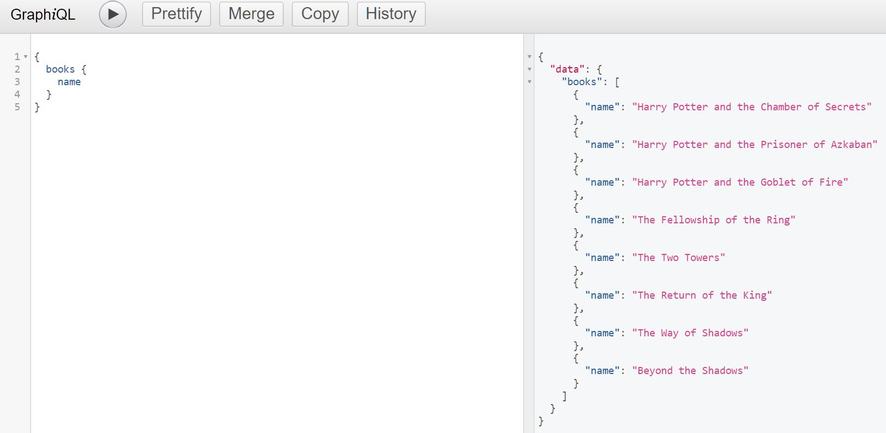
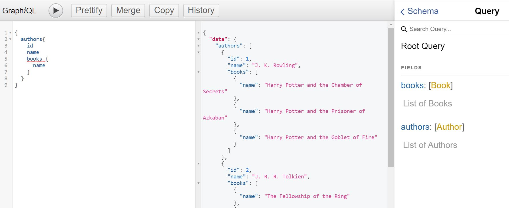
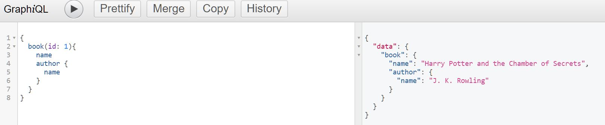
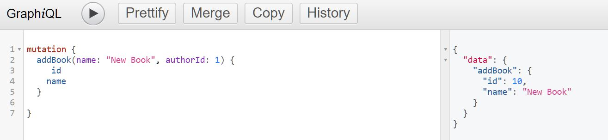

# GraphQL Basics

---

### Tutorial I followed: [Learn GraphQL In 40 Minutes | Web Dev Simplified](https://www.youtube.com/watch?v=ZQL7tL2S0oQ&list=PLlKsfUJvPsn74wuise4cGRy3Z9tC2A56O&index=39)

### Author's GitHub Repo: https://github.com/WebDevSimplified/Learn-GraphQL

---

## Dependencies

**1. nodemon**

**2. express**

**3. express-graphql**: Create a GraphQL HTTP server with any HTTP web framework that supports connect styled middleware, including Connect itself, Express and Restify.

- https://www.npmjs.com/package/express-graphql

**4. Graphql.js**: The JavaScript reference implementation for GraphQL, a query language for APIs created by Facebook.

- https://www.npmjs.com/package/graphql

---

## Code Snippets

- **Initial Query Setup - Hello World**

```javascript
const { GraphQLSchema, GraphQLObjectType, GraphQLString } = require("graphql");

//build a GraphQL type schema to define our query section
const schema = new GraphQLSchema({
  query: new GraphQLObjectType({
    //query section defines all the use cases of our queries
    name: "Hello_World", //"Hello World" object has a 'message' field, which will return a 'string'
    fields: () => ({
      //Inside objects, we have 'fields' to query in order to retrieve data
      message: {
        type: GraphQLString, //tell what types the fields are
        resolve: () => "Hello_World" //information returned by the query field
      }
    })
  })
});
```



- **Query Books (the Name of the Books)** (Can also query the id and authorId on books)

1. Code in server.js

```javascript
const BookType = new GraphQLObjectType({
  //BookType (our customised type) defined here
  name: "Book",
  description: "A book written by an author",
  fields: () => ({
    id: { type: GraphQLNonNull(GraphQLInt) }, //type 'integer', which can't return 'null'
    name: { type: GraphQLNonNull(GraphQLString) },
    authorId: { type: GraphQLNonNull(GraphQLInt) }
    }
  })
});

const RootQueryType = new GraphQLObjectType({
  name: "Query",
  description: "Root Query",
  fields: () => ({
    books: {
      type: new GraphQLList(BookType), //A customised type 'BookType' (which is a 'list')
      description: "List of Books",
      resolve: () => books
    }
  }) //closure? wrapped {} in () so that we can just return this object
});

const schema = new GraphQLSchema({
  query: RootQueryType
});
```

2. Code to query GraphQL in browser (http://localhost:5000/graphql)

```javascript
{
  books {
    name
  }
}
```



- **Query Authors**

```javascript
const AuthorType = new GraphQLObjectType({
  //AuthorType (our customised type) defined here
  name: "Author",
  description: "An author of a book",
  fields: () => ({
    id: { type: GraphQLNonNull(GraphQLInt) },
    name: { type: GraphQLNonNull(GraphQLString) },
    books: {
      type: new GraphQLList(BookType),
      resolve: author => {
        // 1st arg in resolve is the parent property ('author')
        return books.filter(book => book.authorId === author.id); //'filter': an author can have many books
      }
    }
  })
});

const RootQueryType = new GraphQLObjectType({
  name: "Query",
  description: "Root Query",
  fields: () => ({
    authors: {
      type: new GraphQLList(AuthorType), //AuthorType: Our customised type (which is a 'list')
      description: "List of Authors",
      resolve: () => authors
    }
  })
});
```



- **Query A Single Book**

```javascript
const RootQueryType = new GraphQLObjectType({
  name: "Query",
  description: "Root Query",
  fields: () => ({
    book: {
      type: BookType,
      description: "A Single Book",
      args: {
        id: { type: GraphQLInt }
      },
      resolve: (parent, args) => books.find(book => book.id === args.id) //'find': a book only has 1 id
    }
  })
});
```



- **Create Root Mutation Type (Add a Book)**

```javascript
const schema = new GraphQLSchema({
  mutation: RootMutationType
});

const RootMutationType = new GraphQLObjectType({
  name: "Mutation",
  description: "Root mutation",
  fields: () => ({
    addBook: {
      type: BookType,
      description: "Add a book",
      args: {
        name: { type: GraphQLNonNull(GraphQLString) },
        authorId: { type: GraphQLNonNull(GraphQLInt) }
      },
      resolve: (parent, args) => {
        //Create a new book
        const book = {
          id: books.length + 1,
          name: args.name,
          authorId: args.authorId
        };
        books.push(book); //Add new book into books array
        return book;
      }
    }
  })
});
```


